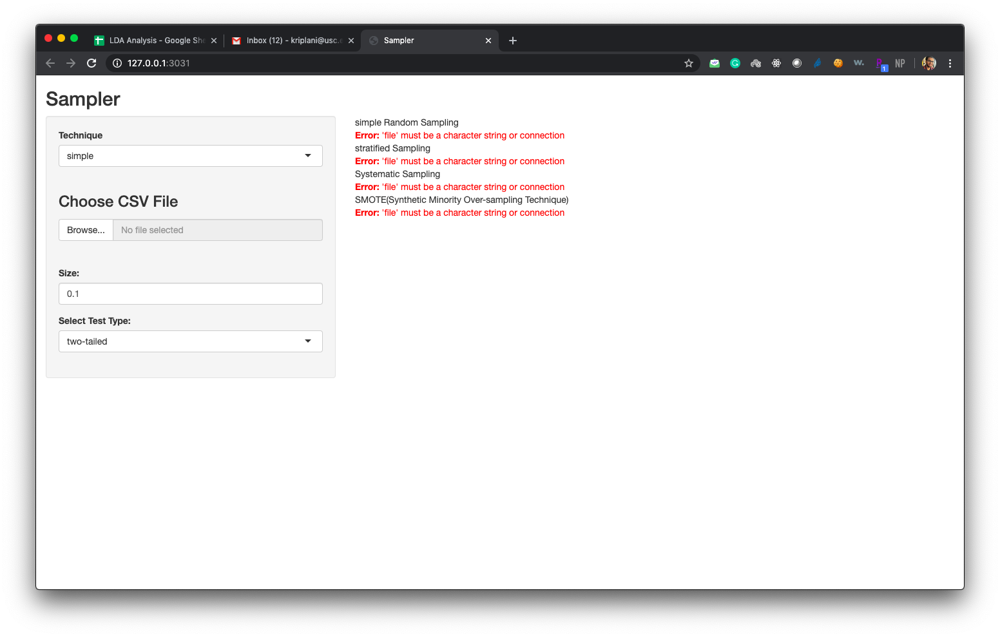

# Sampler-in-R

A shiny web-app to sample (to select a small amount of data from huge dataset) your data based
on different sampling techniques such as SMOTE, ROSE, Stratified Sampling, and others. 

A Web-app which let user upload csv and show them a dataset summary
Display the missing and unique value for each feature; provided the options for handling the missing values such as replace with mean, mode, median, knn(K nearest neighbours)
clustering algorithm
Prepared customized exploratory data analysis(EDA) using pandas, numpy and matplotlib
Performed a data distribution and hypothesis test such as (t-test, two tailed t-tests, chi-square tests, Anova tests to check the usefulness of data)
Provided the options to perform the regression or classification machine learning model on a dataset

## Home Page

